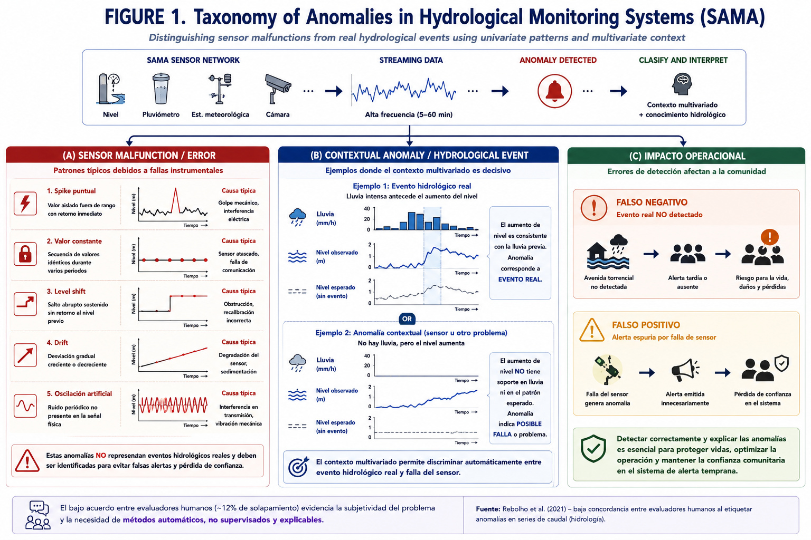

# Detección de Anomalías en Series de Tiempo Hidrológicas
## Plan de Acción para el Sistema SAMA — Antioquia, Colombia

**Versión**: 2.0  
**Fecha**: Junio 2026  

---

## 1. Contexto y Restricciones del Problema

El Sistema de Alerta y Monitoreo de Antioquia (SAMA) instrumentaliza cuencas de alto riesgo con sensores de nivel y pluviómetros, entre otros, con frecuencias de muestreo de 5 a 15 minutos. El punto de partida para este plan es una base de datos histórica de menos de un año, con datos que han pasado por un proceso de calidad básico (verificación de rangos físicos).

Este contexto impone restricciones concretas que definen toda la estrategia metodológica:

**Sin etiquetas de anomalías**: no existe un conjunto de datos anotado que indique cuáles observaciones son anómalas. Esto descarta directamente los métodos supervisados y exige un enfoque completamente no supervisado, donde la validación de los modelos depende de inspección visual y criterio experto hidrológico.

**Historia corta (< 1 año)**: muchos métodos que explotan estacionalidad anual son inestables o no aplicables. En particular, Prophet — que modela ciclos anuales mediante series de Fourier — requiere al menos dos ciclos anuales completos para estimar correctamente la componente estacional bimodal de las cuencas andinas. Prophet se propone como meta de mediano plazo, no como herramienta de arranque.

**Frecuencias de muestreo heterogéneas entre sensores**: distintos instrumentos reportan a 5, 10 o 15 minutos. Esto impide construir matrices multivariadas alineadas temporalmente de forma confiable en esta etapa, por lo que todos los modelos de detección deben ser **estrictamente univariados** — un modelo por serie, por estación.

**Datos con calidad básica aplicada**: el histórico disponible ya pasó por verificación de rangos físicos. Esto significa que los errores más groseros (valores negativos, fuera de rango absoluto) ya fueron removidos o marcados. El pipeline propuesto opera sobre este dataset de entrada y se enfoca en anomalías más sutiles.

---

## 2. Taxonomía de Anomalías Objetivo

Dado que los datos ya tienen calidad de rango aplicada, las anomalías que el pipeline debe detectar son las que ese proceso no captura:


*Figura 1. Taxonomía de anomalías en sistemas de monitoreo hidrológico. Se distinguen fallas instrumentales (A), anomalías contextuales e hidrológicas (B) y su impacto operacional (C).*

| Tipo | Descripción | ¿Detectable con rangos? | Prioridad |
|------|-------------|------------------------|-----------|
| Spike puntual | Valor aislado fuera de lo esperado, retorno inmediato | Parcialmente | Alta |
| Valor constante | Secuencia de valores idénticos por N períodos | No | Alta |
| Level shift | Salto abrupto sostenido sin retorno | No | Alta |
| Drift | Desviación gradual creciente o decreciente | No | Media |
| Oscilación artificial | Ruido periódico no presente en la señal física | No | Media |

La distinción entre **falla de sensor** y **evento hidrológico real** es el problema central. Un aumento brusco de nivel puede ser un spike de sensor o el inicio de una avenida torrencial. Sin datos multivariados alineados, esta distinción en esta etapa debe quedar a criterio del operador; el sistema provee el flag y el contexto, no la decisión final.

Un hallazgo relevante de la literatura es que la concordancia entre evaluadores humanos al etiquetar anomalías en series de caudal es sorprendentemente baja — en torno al 12% de solapamiento entre pares de analistas (Rebolho et al., 2021). Esto refuerza el diseño no supervisado y la necesidad de que el sistema explique su decisión, no solo emita una bandera binaria.

---

## 3. Estrategia Metodológica: Complejidad Incremental

La propuesta central es una **progresión de complejidad creciente**, comenzando con los métodos más simples e interpretables y avanzando a medida que se acumula historia, se adquiere confianza en los modelos y eventualmente se construye un conjunto de datos etiquetado.

Esta progresión tiene una lógica operativa: los métodos simples son fáciles de explicar a operadores e hidrológos, fallan de formas predecibles y establecen un baseline contra el cual evaluar métodos más complejos.

```
ETAPA 1 — Arranque          ETAPA 2 — Consolidación     ETAPA 3 — Madurez
(0–6 meses de historia)     (6–18 meses)                (> 18 meses)

Cuantiles históricos    →   STL + IQR               →   Prophet + IC
                        →   SARIMA residuals         →   (+ datos etiquetados
                                                          acumulados)
```

Cada etapa hereda los modelos de la anterior y los mantiene activos como baseline. No se reemplazan — se suman capas.

---

## 4. Descripción de Métodos por Etapa

### Etapa 1 — Cuantiles Históricos

**Cuándo aplicar**: desde el primer día, con cualquier cantidad de historia disponible.

**Fundamento**: el método más simple posible. Se calculan los percentiles empíricos de la distribución histórica de cada serie. Un valor nuevo se marca como anómalo si cae fuera del rango `[Q_α/2, Q_{1-α/2}]` donde `α` es el nivel de significancia (típicamente 0.01 o 0.02).

```python
import numpy as np

def detector_cuantiles(historia: np.ndarray, nuevo_valor: float,
                       alpha: float = 0.01) -> dict:
    q_low = np.quantile(historia, alpha / 2)
    q_high = np.quantile(historia, 1 - alpha / 2)
    es_anomalia = (nuevo_valor < q_low) or (nuevo_valor > q_high)
    score = max(
        (q_low - nuevo_valor) / (q_high - q_low + 1e-9),
        (nuevo_valor - q_high) / (q_high - q_low + 1e-9),
        0.0
    )
    return {"anomalia": es_anomalia, "score": score,
            "q_low": q_low, "q_high": q_high}
```

**Variante por contexto temporal**: en lugar de usar toda la historia, calcular cuantiles por **hora del día** y por **mes** (cuando haya suficiente historia). Esto convierte el detector global en uno contextual sin necesidad de descomposición:

```python
# Cuantiles condicionados a hora del día
def cuantiles_por_hora(df: pd.DataFrame, alpha: float = 0.01) -> pd.DataFrame:
    return df.groupby(df.index.hour)['valor'].quantile(
        [alpha / 2, 1 - alpha / 2]
    ).unstack()
```

**Detección de valor constante** (complemento obligatorio desde Etapa 1):

```python
def detector_constante(serie: pd.Series, n_min: int = 6) -> bool:
    """Retorna True si los últimos n_min valores son idénticos."""
    return serie.iloc[-n_min:].nunique() == 1
```

**Limitaciones**:
- No captura la estructura temporal — un valor puede ser normal en temporada de lluvias y anómalo en verano, y el detector global no lo distingue
- Sensible a la calidad del histórico inicial: si hay anomalías no detectadas en el histórico, los cuantiles se corrompen
- No detecta drift ni level shifts (valores dentro del rango global pero inconsistentes con el comportamiento reciente)

**Reentrenamiento**: recalcular cuantiles mensualmente con ventana deslizante de toda la historia disponible. Operación trivial, sin hiperparámetros que optimizar.

---

### Etapa 2a — STL + IQR (para sensores de nivel)

**Cuándo aplicar**: con al menos 60–90 días de historia limpia a resolución sub-horaria.

**Fundamento**: STL descompone la serie en tendencia, componente estacional y residual. El IQR se aplica sobre el residual. La diferencia clave respecto a los cuantiles es que STL *sustrae el patrón esperado* antes de evaluar: un valor alto en época de lluvias no genera residual alto si el modelo ya sabe que esa época tiene valores altos.

```
Y(t) = Tendencia(t) + Estacionalidad(t) + Residual(t)
Anomalía si: |Residual(t)| > Q3 + k · IQR  o  < Q1 - k · IQR
```

Para datos a 15 minutos con ciclo diario, `period = 96` (96 muestras × 15 min = 24 horas).

```python
from statsmodels.tsa.seasonal import STL

def entrenar_stl(serie: pd.Series, period: int = 96) -> dict:
    stl = STL(serie, period=period, robust=True)
    resultado = stl.fit()
    residual = resultado.resid
    Q1, Q3 = np.percentile(residual, [25, 75])
    IQR = Q3 - Q1
    return {"modelo": resultado, "Q1": Q1, "Q3": Q3, "IQR": IQR,
            "tendencia": resultado.trend, "estacional": resultado.seasonal}

def detectar_stl_iqr(residual_nuevo: float, params: dict,
                     k: float = 3.0) -> dict:
    lim_inf = params["Q1"] - k * params["IQR"]
    lim_sup = params["Q3"] + k * params["IQR"]
    es_anomalia = (residual_nuevo < lim_inf) or (residual_nuevo > lim_sup)
    score = max(
        (lim_inf - residual_nuevo) / (params["IQR"] + 1e-9),
        (residual_nuevo - lim_sup) / (params["IQR"] + 1e-9),
        0.0
    )
    return {"anomalia": es_anomalia, "score": score,
            "lim_inf": lim_inf, "lim_sup": lim_sup}
```

**Por qué STL para nivel y no para lluvia**: el nivel de río tiene un ciclo diario relativamente estable (influenciado por temperatura, evapotranspiración y dinámica fluvial base) cuya estructura STL captura bien con `period=96`. La lluvia, en cambio, es intermitente (muchos ceros), asimétrica y su ciclo anual bimodal no puede representarse con un único `period` — para lluvia, STL no es apropiado.

**Reentrenamiento**: semanal, con ventana deslizante de los últimos 60 días.

---

### Etapa 2b — SARIMA Residuals (nivel y lluvia)

**Cuándo aplicar**: con al menos 90 días de historia, en paralelo con STL.

**Fundamento**: SARIMA modela la serie como función de sus valores pasados y errores pasados, capturando la **dependencia temporal de corto plazo**. La anomalía se define por el residuo del modelo: un valor es anómalo si es inconsistente con los últimos N valores observados, independientemente del patrón estacional.

Esto es complementario a STL: STL detecta anomalías respecto al patrón esperado; SARIMA detecta anomalías respecto a la dinámica reciente. Un nivel que sube abruptamente puede ser normal estacionalmente pero anómalo dinámicamente.

```python
from pmdarima import auto_arima

def seleccionar_orden_sarima(serie_train: pd.Series,
                              m: int = 96) -> dict:
    """
    Selección automática de orden. Se ejecuta una vez por estación
    durante el setup, no en cada inferencia.
    m: período estacional (96 para 15-min con ciclo diario)
    """
    modelo = auto_arima(
        serie_train,
        seasonal=True, m=m,
        stepwise=True,          # búsqueda eficiente
        suppress_warnings=True,
        error_action='ignore',
        max_p=3, max_q=3,
        max_P=2, max_Q=2
    )
    return modelo

def detectar_sarima(modelo, serie_nueva: pd.Series,
                    k_sigma: float = 3.0) -> dict:
    pred = modelo.predict_in_sample(return_conf_int=True, alpha=0.01)
    residuos = serie_nueva.values - pred[0]
    sigma = np.std(residuos[~np.isnan(residuos)])
    anomalias = np.abs(residuos) > k_sigma * sigma
    return anomalias, np.abs(residuos) / (sigma + 1e-9)
```

**Nota sobre lluvia**: la distribución fuertemente asimétrica de lluvia (muchos ceros, cola derecha larga) requiere transformación antes de SARIMA. Se recomienda transformación Box-Cox o simplemente log(x + 1).

**Reentrenamiento**: mensual, con ventana deslizante de 90 días.

---

### Etapa 3 — Prophet + Intervalo de Credibilidad (lluvia, mediano plazo)

**Cuándo aplicar**: cuando se disponga de al menos 2 ciclos anuales completos (~18–24 meses de historia). No aplicar antes — con historia corta, los armónicos de Fourier que representan la estacionalidad anual no convergen bien y el modelo genera intervalos incorrectos.

**Fundamento**: Prophet modela la serie como suma de componentes con estructura bayesiana, incluyendo múltiples estacionalidades simultáneas. Para lluvia en cuencas andinas, la estacionalidad anual bimodal (dos temporadas de lluvias: marzo–mayo y septiembre–noviembre) es precisamente el tipo de estructura que Prophet está diseñado para capturar.

```python
from prophet import Prophet

def entrenar_prophet_lluvia(df_train: pd.DataFrame) -> Prophet:
    """df_train con columnas 'ds' (datetime) y 'y' (lluvia)."""
    modelo = Prophet(
        interval_width=0.99,
        yearly_seasonality=True,       # captura bimodalidad anual
        daily_seasonality=True,        # captura ciclo convectivo vespertino
        seasonality_mode='multiplicative',  # varianza escala con la media
        changepoint_prior_scale=0.05   # tendencia poco flexible (lluvia es estacionaria)
    )
    modelo.fit(df_train)
    return modelo

def detectar_prophet(modelo: Prophet, df_nuevo: pd.DataFrame) -> pd.DataFrame:
    forecast = modelo.predict(df_nuevo[['ds']])
    resultado = df_nuevo.merge(
        forecast[['ds', 'yhat_lower', 'yhat_upper']], on='ds'
    )
    resultado['anomalia'] = (
        (resultado['y'] < resultado['yhat_lower']) |
        (resultado['y'] > resultado['yhat_upper'])
    )
    resultado['score'] = np.maximum(
        (resultado['yhat_lower'] - resultado['y']) /
        (resultado['yhat_upper'] - resultado['yhat_lower'] + 1e-9),
        (resultado['y'] - resultado['yhat_upper']) /
        (resultado['yhat_upper'] - resultado['yhat_lower'] + 1e-9)
    ).clip(lower=0)
    return resultado

```

**Por qué Prophet y no STL para lluvia**:
- STL con un único `period` no puede representar la estacionalidad bimodal anual
- Prophet maneja nativamente gaps de datos (frecuentes en sensores de campo)
- El intervalo de credibilidad es más informativo que un umbral IQR para comunicar incertidumbre a operadores

**Reentrenamiento**: mensual con ventana deslizante de los últimos 365 días.

---

## 5. Arquitectura del Pipeline


*Figura 2. Pipeline escalonado de detección de anomalías para SAMA. Cada capa actúa como filtro progresivo con complejidad y latencia crecientes.*

El pipeline implementa un principio de **complejidad incremental activa**: en producción corren simultáneamente todos los modelos disponibles en la etapa actual. Las salidas de cada modelo se agregan en un score final ponderado, no en una lógica de fail-fast pura. Esto permite que modelos simples y complejos se complementen y que el operador vea qué modelos flaggearon el punto.

```
Dato entrante (serie univariada por sensor)
        │
        ▼
┌─────────────────────────────────────────┐
│  VALIDACIÓN PREVIA (heredada de QA)     │
│  Rango físico, gaps, ceros inválidos    │
└─────────────┬───────────────────────────┘
              │
              ▼
┌─────────────────────────────────────────┐
│  CAPA 1 — Cuantiles históricos          │  Siempre activa
│  + detector de valor constante          │  Score: s1
└─────────────┬───────────────────────────┘
              │
              ▼
┌─────────────────────────────────────────┐
│  CAPA 2 — STL+IQR (nivel)              │  Activa desde Etapa 2
│           SARIMA residuals (ambas)      │  Score: s2
└─────────────┬───────────────────────────┘
              │
              ▼
┌─────────────────────────────────────────┐
│  CAPA 3 — Prophet + IC (lluvia)         │  Activa desde Etapa 3
│           (≥ 18 meses de historia)      │  Score: s3
└─────────────┬───────────────────────────┘
              │
              ▼
     Score agregado: S = w1·s1 + w2·s2 + w3·s3
     Alerta si S ≥ umbral adaptativo
```

El **score agregado ponderado** permite graduar la alerta (warning vs. crítica) y registrar cuánto contribuyó cada modelo — información valiosa para el operador y para el loop de feedback.

Los pesos `w1, w2, w3` se calibran empíricamente durante la validación operacional. Un punto de partida razonable: `w1=0.2, w2=0.5, w3=0.3` (STL+SARIMA dominan cuando están disponibles).

---

## 6. Gestión del Entrenamiento Inicial

### 6.1 Preparación del histórico base

El histórico inicial, aunque ya tiene calidad de rango aplicada, requiere pasos adicionales antes de usarse para entrenar:

1. **Detección de gaps**: identificar períodos sin datos. Los gaps > 2 horas deben marcarse explícitamente, no imputarse con la media — especialmente si coinciden con eventos de lluvia intensa (los sensores fallan precisamente durante eventos extremos).

2. **Limpieza de cuantiles extremos**: aunque el rango físico fue verificado, pueden existir valores en los percentiles 0.1% y 99.9% que son técnicamente válidos pero distorsionan los modelos. Se recomienda aplicar winsorización leve antes del entrenamiento (no del almacenamiento).

3. **Segmentación por sensor**: cada sensor entrena su propio modelo independiente. No hay matriz multivariada en esta etapa.

4. **Inspección visual obligatoria**: antes de entrenar el primer modelo sobre un sensor, un analista debe revisar la serie completa. Dada la ausencia de etiquetas, esta inspección inicial es el único mecanismo de validación de ground truth disponible.

### 6.2 Arranque sin etiquetas: estrategia de validación

La ausencia de etiquetas impide calcular métricas supervisadas (precision, recall, F1). La estrategia de validación en esta etapa es:

**Validación visual**: el analista revisa una muestra de los puntos flaggeados por cada modelo y los clasifica como verdadero positivo o falso positivo. Esta clasificación retroalimenta el ajuste de umbrales y, progresivamente, construye el primer conjunto de datos etiquetado.

**Métricas operacionales proxy**:
- *Tasa de alertas por sensor por semana*: un modelo bien calibrado debería generar entre 0.5% y 3% de alertas sobre el total de datos. Tasas superiores indican umbral demasiado sensible; inferiores, modelo insuficientemente sensible.
- *Distribución temporal de alertas*: las alertas deberían correlacionar con períodos de lluvia intensa o eventos conocidos, no distribuirse aleatoriamente.
- *Concordancia entre modelos*: si Cuantiles y SARIMA coinciden en flaggear un punto, la probabilidad de que sea anomalía real es mayor que si solo uno de ellos lo detecta.

**Protocolo de feedback humano** (desde el primer día):

```
Punto flaggeado
      │
      ▼
Cola de revisión (operador)
      │
      ├──► Confirma anomalía → excluir de entrenamiento futuro
      │                        + agregar a dataset etiquetado
      │
      └──► Falso positivo  → registrar + ajustar umbral del modelo
                             que generó el falso positivo
```

Este loop es el mecanismo principal de mejora continua y la única forma de construir etiquetas en ausencia de un dataset anotado previo.

---

## 7. Pipeline de Reentrenamiento (MLOps)

### 7.1 Frecuencias por modelo

| Modelo | Variable | Frecuencia | Ventana de entrenamiento | Datos mínimos requeridos |
|--------|----------|------------|--------------------------|--------------------------|
| Cuantiles | Nivel y lluvia | Mensual | Toda la historia disponible | 7 días |
| STL + IQR | Nivel | Semanal | Últimos 60 días | 60 días |
| SARIMA | Nivel y lluvia | Mensual | Últimos 90 días | 90 días |
| Prophet | Lluvia | Mensual | Últimos 365 días | 730 días (2 años) |

**Razonamiento de las ventanas**:
- Los cuantiles se benefician de toda la historia disponible (más datos = mejor estimación de percentiles extremos).
- STL necesita historia suficiente para estimar la estacionalidad diaria, pero no más de 60 días — historia muy larga introduce no-estacionariedad.
- SARIMA con 90 días captura bien la dinámica estacional diaria sin perder sensibilidad a cambios recientes.
- Prophet necesita múltiples ciclos anuales; no se activa hasta tener 2 años.

### 7.2 Triggers de reentrenamiento reactivo

Además del calendario, el sistema debe reentrenar cuando detecte degradación del modelo:

**Deriva en tasa de alertas (proxy de model drift)**:
```
Si tasa_alertas_últimas_2_semanas > 3 × tasa_alertas_baseline:
    → umbral probablemente desactualizado → reentrenar
```

**Cambio estructural en la serie (CUSUM sobre media rolling)**:
```python
def detectar_cambio_estructural(serie: pd.Series,
                                 ventana: int = 96*7,   # 1 semana a 15-min
                                 umbral_delta: float = 0.3) -> bool:
    """Compara la media de la última semana con la semana anterior."""
    if len(serie) < 2 * ventana:
        return False
    media_reciente = serie.iloc[-ventana:].mean()
    media_anterior = serie.iloc[-2*ventana:-ventana].mean()
    rango = serie.quantile(0.95) - serie.quantile(0.05) + 1e-9
    return abs(media_reciente - media_anterior) / rango > umbral_delta
```

**Reemplazo o recalibración de sensor**: este evento debe registrarse en el sistema de gestión de activos y disparar automáticamente el reentrenamiento de todos los modelos de ese sensor, reseteando la ventana de entrenamiento desde la fecha del cambio.

### 7.3 Stack MLOps recomendado

| Componente | Herramienta | Rol |
|------------|-------------|-----|
| Orquestación | **Prefect** (más simple que Airflow) | DAGs de reentrenamiento programado y reactivo |
| Registro de modelos | **MLflow** | Versionar modelos por sensor, tracking de parámetros y métricas |
| Monitoreo de drift | **Evidently AI** | Reportes automáticos de drift en distribución de entrada |
| Almacenamiento de series | **TimescaleDB** (PostgreSQL + extensión) | Eficiente para series de tiempo a alta frecuencia |
| Servicio de inferencia | **FastAPI** + worker async | Liviano, adecuado para on-premise |
| Versionado de datos | **DVC** | Reproducibilidad de entrenamientos por sensor |

### 7.4 DAG de reentrenamiento (Prefect)

```python
from prefect import flow, task
import mlflow

@task
def verificar_datos_suficientes(sensor_id: str, modelo: str,
                                  min_dias: int) -> bool:
    n_dias = contar_dias_historia_limpia(sensor_id)
    return n_dias >= min_dias

@task
def reentrenar_modelo(sensor_id: str, modelo_tipo: str,
                      ventana_dias: int) -> dict:
    datos = cargar_datos_limpios(sensor_id, dias=ventana_dias)
    # excluir puntos confirmados como anómalos por operadores
    datos = excluir_anotados_anomalos(datos, sensor_id)
    nuevo_modelo = entrenar(modelo_tipo, datos)
    metricas = calcular_metricas_operacionales(nuevo_modelo, datos)
    return {"modelo": nuevo_modelo, "metricas": metricas}

@task
def promover_modelo(sensor_id: str, nuevo_modelo: dict,
                    modelo_tipo: str) -> None:
    with mlflow.start_run():
        mlflow.log_params(nuevo_modelo["modelo"].get_params())
        mlflow.log_metrics(nuevo_modelo["metricas"])
        mlflow.sklearn.log_model(nuevo_modelo["modelo"],
                                  f"{sensor_id}_{modelo_tipo}")

@flow(name="reentrenamiento-semanal-sama")
def pipeline_reentrenamiento_semanal():
    sensores = obtener_lista_sensores_activos()
    for sensor_id in sensores:
        # STL+IQR — semanal para sensores de nivel
        if es_sensor_nivel(sensor_id):
            if verificar_datos_suficientes(sensor_id, "stl_iqr", 60):
                modelo = reentrenar_modelo(sensor_id, "stl_iqr", 60)
                promover_modelo(sensor_id, modelo, "stl_iqr")
```

---

## 8. Hoja de Ruta por Etapas

| Etapa | Tiempo | Historia disponible | Modelos activos | Hito de validación |
|-------|--------|--------------------|-----------------|--------------------|
| **E1 — Arranque** | Meses 1–3 | < 3 meses | Cuantiles + detector constante | Tasa de alertas < 3%, inspección visual de muestra aleatoria |
| **E2 — Consolidación** | Meses 3–9 | 3–9 meses | + STL+IQR (nivel), + SARIMA | Concordancia entre modelos > 60% en alertas, primeras 50 etiquetas manuales |
| **E3 — Madurez** | Mes 18+ | > 18 meses | + Prophet (lluvia) | Evaluación supervisada con dataset etiquetado acumulado, F1 > 0.75 |

### Fase 0 — EDA y setup (previo a E1)

Antes de entrenar cualquier modelo, se requiere:

1. **EDA por sensor**: distribución de valores, histograma, serie temporal completa, identificación de gaps, frecuencia real de muestreo (puede diferir de la nominal).
2. **Caracterización de estacionalidad**: periodograma o autocorrelación para confirmar que existe ciclo diario capturado en los datos disponibles.
3. **Selección de `period`**: para datos a 15-min, `period=96`. Para datos a 5-min, `period=288`. Verificar empíricamente con ACF.
4. **Inspección visual de al menos 4 semanas** por sensor con un analista hidrológico — esta inspección genera las primeras anotaciones informales que orientan la calibración de umbrales.

---

## 9. Consideraciones Específicas para Cuencas Andinas

**Ciclo convectivo vespertino**: en muchas cuencas de Antioquia, la lluvia ocurre preferentemente en las tardes (convección orográfica). Esto genera un ciclo diario fuerte en los pluviómetros que STL y SARIMA capturan, pero que puede confundirse con anomalías si los modelos se inicializan con poca historia.

**Respuesta hiperrápida**: cuencas de montaña con pendientes pronunciadas tienen tiempos de concentración de minutos a pocas horas. A 15-min de resolución, un evento real puede verse como un spike puntual si el tiempo de concentración es menor que el intervalo de muestreo. Estos casos son difíciles de distinguir de fallas de sensor sin contexto adicional.

**Gaps correlacionados con eventos extremos**: los sensores tienden a fallar durante eventos de alta lluvia (inundación del equipo, pérdida de comunicación satelital). Imputar estos gaps con valores promedio es incorrecto y contamina el histórico de entrenamiento. Los gaps > 2 horas durante períodos de lluvia detectada en estaciones vecinas deben marcarse como "gap durante evento potencial" y excluirse del entrenamiento.

**Distribución no-gaussiana de lluvia**: las series de lluvia tienen distribución fuertemente asimétrica con exceso de ceros. Para SARIMA, se recomienda transformación log(x + 0.1) antes del ajuste. Para cuantiles, el percentil 0% es cero la mayor parte del tiempo — usar los percentiles condicionados a lluvia > 0 para el umbral superior, y tratar la ocurrencia (lluvia vs. no-lluvia) como variable binaria separada.

---

## 10. Referencias

- Blázquez-García et al. (2021). A review on outlier/anomaly detection in time series data. *ACM Computing Surveys*, 54(3), 1–33.
- Darban et al. (2024). Deep Learning for Time Series Anomaly Detection: A Survey. *ACM Computing Surveys*.
- DAGRAN (2023). Sistema de Alerta y Monitoreo de Antioquia — SAMA. Gobernación de Antioquia.
- Kulanuwat et al. (2021). Anomaly detection using a sliding window technique and data imputation with machine learning for hydrological time series. *Water*, 13(13).
- Leigh et al. (2019). A framework for automated anomaly detection in high-frequency water-quality data from in situ sensors. *Journal of Hydrology*, 586, 124797.
- Liu et al. (2008). Isolation Forest. *IEEE International Conference on Data Mining*.
- Rebolho et al. (2021). Anomaly detection in streamflow time series — inter-evaluator agreement study, 674 series. *ResearchGate*.
- Taylor, S. J. & Letham, B. (2018). Forecasting at scale. *The American Statistician*, 72(1), 37–45.
- Ye et al. (2025). A Survey of Deep Anomaly Detection in Multivariate Time Series. *Sensors*, 25(1), 190.

---

*Este documento es un borrador técnico interno. Para comentarios o revisiones, contactar al equipo de modelamiento hidrológico.*
